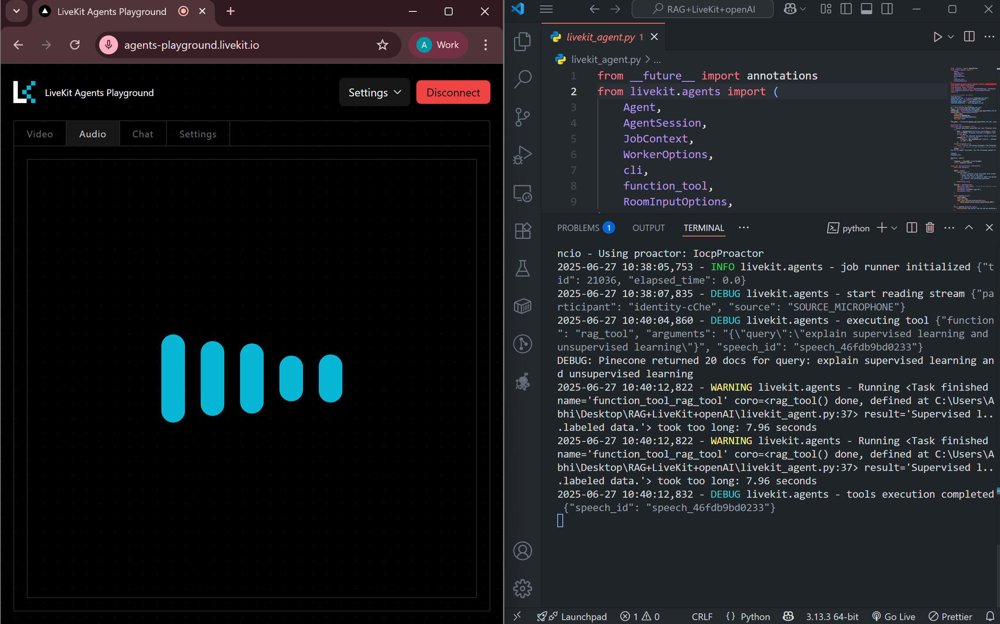
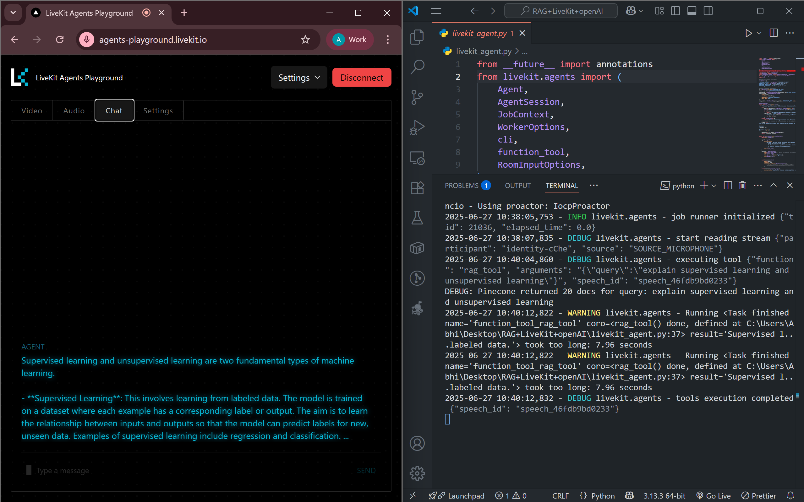
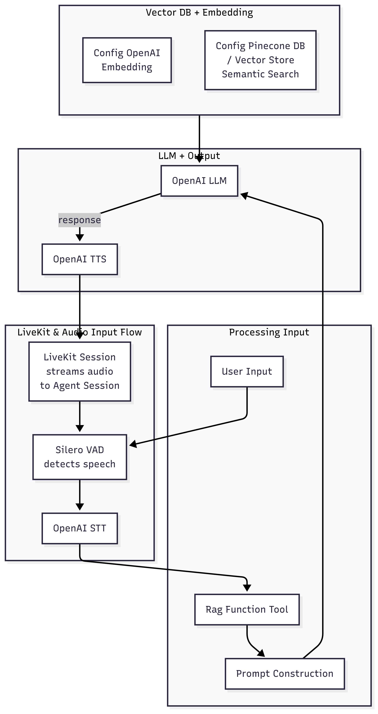
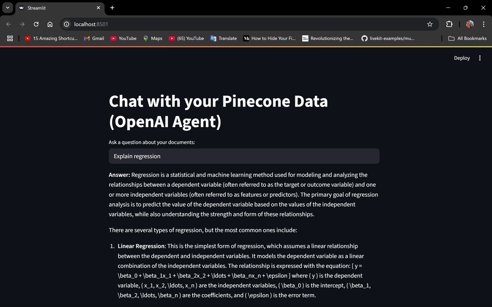

# RAG-LiveKit-OpenAI---Voice-Assistant
Voice Assistant with RAG, LiveKit, and OpenAI Chat or talk with your own documents using Retrieval-Augmented Generation (RAG), Pinecone, OpenAI, and LiveKit. Includes a Streamlit chat UI and a real-time voice agent for LiveKit rooms.

## 📸 Project Overview


*LiveKit voice interaction*


LiveKit chat interaction

*System-flow*

## 📁 Project Structure

```
RAG+LiveKit+openAI/
├── KMS/                  # (Custom folder, not used by core code)
├── pdfs/                 # Place your PDF files here for ingestion
├── venv/                 # Python virtual environment (auto-generated)
├── .env                  # Environment variables (not committed)
├── app.py                # Streamlit chat UI for RAG
├── livekit_agent.py      # LiveKit voice agent backend
├── main_load.py          # Loads and indexes PDFs into Pinecone
├── requirements.txt      # Python dependencies
├── test1.py              # (Your test scripts)
├── test2.py
├── test3.py
└── Images ...    # (Your images, not used by code)
```

---

## 🚀 Quick Start

### 1. **Clone the repository**

```sh
git clone https://github.com/yourusername/your-repo.git
cd RAG+LiveKit+openAI
```

### 2. **Set up your environment**

```sh
python -m venv venv
venv\Scripts\activate  # On Windows
# or
source venv/bin/activate  # On Mac/Linux
pip install -r requirements.txt
```

### 3. **Configure environment variables**

Create a `.env` file in the root directory with your keys:
```
PINECONE_API_KEY=your-pinecone-key
OPENAI_API_KEY=your-openai-key
LIVEKIT_URL=your-livekit-url
LIVEKIT_API_KEY=your-livekit-api-key
LIVEKIT_API_SECRECT=your-live-api-secrect
```

### 4. **Add your PDFs**

Place your PDF files inside the `pdfs/` folder.

---

## 🗂️ Index Your Documents

Run the loader to split and index your PDFs into Pinecone:

```sh
python main_load.py
```

---

## 💬 Run the Streamlit RAG Chat UI

```sh
streamlit run app.py
```
Open the local URL shown in your browser.  
Ask questions about your documents!



---

## 🗣️ Run the LiveKit Voice Agent

```sh
python livekit_agent.py dev
```
This will start the backend agent that listens and responds in a LiveKit room.

---

## 🕹️ Test with LiveKit Playground

You can use the [LiveKit Playground](https://playground.livekit.io/) to easily test your voice agent:

1. **Open [LiveKit Playground](https://playground.livekit.io/)** in your browser.
2. **Create a new room** (choose any room name, e.g., `my-room`).
3. **Join the room** with your browser client.
4. **Start your agent** with the same room name (see above).
5. You can now interact with your agent in real time using your browser and microphone.

This is a quick way to test your LiveKit agent without building a custom frontend.  
Just make sure the room name in the Playground matches the one your agent joins.

---

## 📝 File Descriptions

- **app.py**  
  Streamlit web UI for chatting with your document knowledge base.

- **main_load.py**  
  Loads PDFs from `pdfs/`, splits them, and indexes them into Pinecone.

- **livekit_agent.py**  
  Backend agent that joins a LiveKit room and answers questions using RAG and OpenAI.

- **requirements.txt**  
  All Python dependencies.

- **test1.py, test2.py, test3.py**  
  Your test scripts (not required for main workflow).

---

## 🛠️ Troubleshooting

- **No results from Pinecone:**  
  - Ensure your namespace, index name, and embedding model match in all scripts.
  - Check `main_load.py` output for successful indexing.

- **Streamlit errors:**  
  - Make sure your `.env` file is set up and dependencies are installed.

- **LiveKit errors:**  
  - Ensure your LiveKit server is running and accessible.

---

## 📚 Credits

- [LiveKit](https://livekit.io/)
- [OpenAI](https://openai.com/)
- [Pinecone](https://www.pinecone.io/)
- [LangChain](https://www.langchain.com/)

---