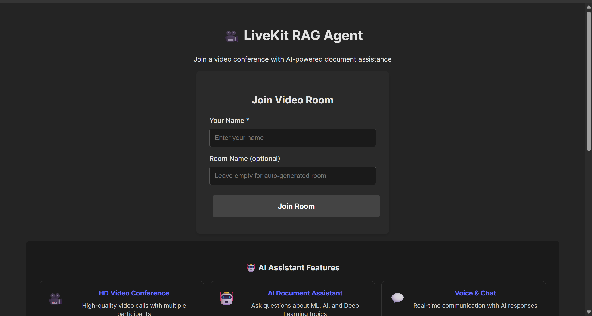

# LiveKit RAG Agent - Frontend + Backend Setup

This project provides a complete setup for a LiveKit-powered video conferencing application with RAG (Retrieval-Augmented Generation) capabilities.


## Project Structure & What to Keep

```
RAG+LiveKit+openAI/
├── main.py              # FastAPI backend (token/room generation)
├── livekit_agent.py     # LiveKit agent for AI document Q&A
├── .env                 # Environment variables (API keys, secrets)
├── requirements.txt     # Python dependencies
├── frontend/            # React frontend (user interface)
│   ├── src/
│   │   ├── App.tsx
│   │   ├── main.tsx
│   │   └── index.css
│   ├── package.json
│   └── vite.config.ts
├── image.png            # Application screenshot
└── README.md
```

> **Remove or ignore:**
> - `test_env.py`, `test1.py`, `test2.py`, `test3.py`, `tempCodeRunnerFile.py` (utility/testing/old files, not needed for main app)
> - `pdfs/` only if you do not use these for Pinecone ingestion

---

## 📸 Application Screenshot



---

## Local Token & Room Generation

This project allows you to generate LiveKit access tokens and room IDs locally using FastAPI. The backend provides endpoints to:
- Create a new room
- Generate a secure access token for a participant

You can use these endpoints directly or integrate them with your own tools/utilities as needed.

---

## Features

- 🎥 High-quality video conferencing with LiveKit
- 🤖 AI-powered RAG assistant using OpenAI and Pinecone
- 💬 Real-time chat and communication
- 🔐 Secure token-based authentication
- 📱 Responsive React frontend
- ⚡ Fast FastAPI backend

## Setup Instructions

### 1. Backend Setup

1. **Install Python dependencies:**
   ```bash
   cd THIS_IS_FOR_MAKE_IT_RUN_LOCAL
   pip install -r requirements.txt
   ```

2. **Configure environment variables:**
   
   The `.env` file is already configured with:
   - `OPENAI_API_KEY` - Your OpenAI API key
   - `PINECONE_API_KEY` - Your Pinecone API key
   - `LIVEKIT_URL` - Your LiveKit cloud URL
   - `LIVEKIT_API_KEY` - Your LiveKit API key
   - `LIVEKIT_API_SECRET` - Your LiveKit API secret

3. **Start the backend server:**
   ```bash
   python main.py
   ```
   
   The backend will run on `http://localhost:8000`

### 2. Frontend Setup

1. **Navigate to frontend directory:**
   ```bash
   cd frontend
   ```

2. **Install Node.js dependencies:**
   ```bash
   npm install
   ```

3. **Start the development server:**
   ```bash
   npm run dev
   ```
   
   The frontend will run on `http://localhost:5173`

## Usage

1. **Start both servers:**
   - Backend: `python main.py` (runs on port 8000)
   - Frontend: `cd frontend && npm run dev` (runs on port 5173)

2. **Access the application:**
   - Open your browser and go to `http://localhost:5173`
   - Enter your name and optionally a room name
   - Click "Join Room" to start the video conference

3. **Features available:**
   - Video and audio communication
   - Real-time chat
   - AI assistant powered by RAG (ask questions about your documents)
   - Room creation and joining

## API Endpoints

### Backend (FastAPI)

- `GET /` - Health check
- `POST /get-token` - Generate access token for existing room
- `POST /create-room-and-token` - Create room and generate token
- `GET /health` - Health check endpoint

### Request Format

```json
{
  "participant_name": "John Doe",
  "room_name": "optional-room-name"
}
```

### Response Format

```json
{
  "token": "eyJhbGciOiJIUzI1NiIsInR5cCI6IkpXVCJ9...",
  "room_name": "rag-room-abc123",
  "ws_url": "wss://ai-agent-y2jp87hb.livekit.cloud"
}
```

## Development

### Frontend Development

The React frontend uses:
- **Vite** for fast development and building
- **TypeScript** for type safety
- **@livekit/components-react** for LiveKit integration
- **Axios** for API communication

### Backend Development

The FastAPI backend provides:
- **Token generation** for LiveKit authentication
- **Room management** via LiveKit API
- **CORS configuration** for frontend integration
- **Error handling** with detailed logging

## Troubleshooting

### Common Issues

1. **Backend not starting:**
   - Check if all environment variables are set in `.env`
   - Ensure Python dependencies are installed
   - Verify port 8000 is not in use

2. **Frontend not connecting:**
   - Ensure backend is running on port 8000
   - Check browser console for CORS errors
   - Verify frontend is running on port 5173

3. **Video/Audio not working:**
   - Grant browser permissions for camera and microphone
   - Check LiveKit credentials in `.env`
   - Ensure stable internet connection

### Environment Variables

Make sure your `.env` file contains valid credentials:

```env
OPENAI_API_KEY=your_openai_key_here
PINECONE_API_KEY=your_pinecone_key_here
LIVEKIT_URL=wss://your-livekit-url.livekit.cloud
LIVEKIT_API_KEY=your_livekit_api_key
LIVEKIT_API_SECRET=your_livekit_api_secret
```

## Production Deployment

### Backend

1. Use a production WSGI server like Gunicorn
2. Set up proper environment variable management
3. Configure HTTPS and domain
4. Set up monitoring and logging

### Frontend

1. Build the production version: `npm run build`
2. Serve the `dist` folder with a web server
3. Update API URLs for production backend
4. Configure HTTPS and CDN if needed

## License

This project is for demonstration purposes. Make sure to comply with LiveKit, OpenAI, and Pinecone terms of service.
